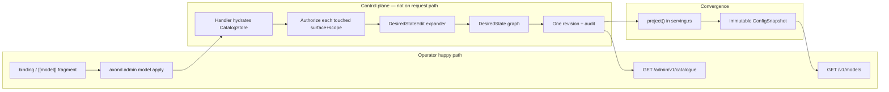
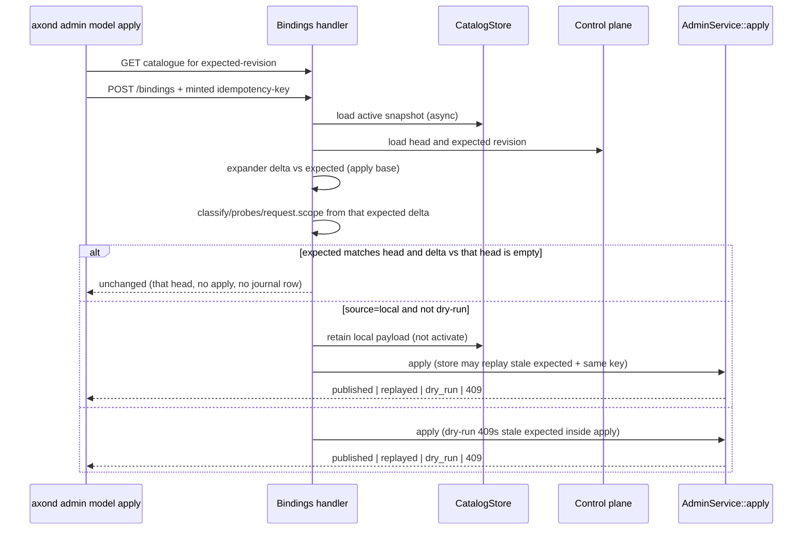
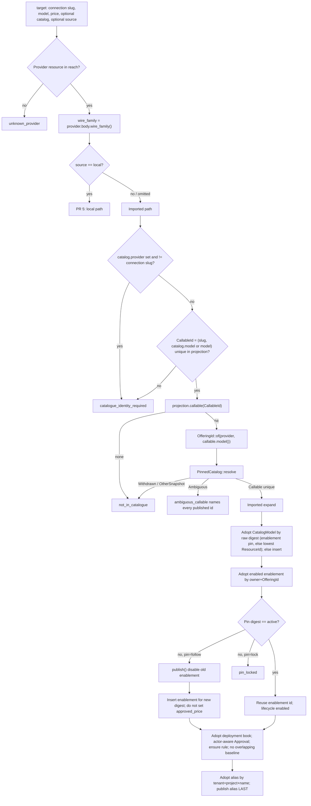

# P0: One operator model for availability and usage

| Field | Value |
| --- | --- |
| **Author** | axond maintainers / Grok design skill |
| **Date** | 2026-08-26 |
| **Status** | **Superseded** by [ADR 0063](../adr/0063-stateful-only-namespaced-gateway.md). Do not implement from this document. |
| **Supersedes (operator surface)** | The four-publication graph taught by `docs/operations/admin-api.md` (“Refreshing a model catalogue”) |
| **Does not supersede (invariants)** | ADR 0027, 0042, 0043, 0046, 0051, 0054, 0055, 0056, 0058, 0059 |

## Overview

Axond’s product promise is that **making a model available and accounting for its usage is simple**. Stateless mode already keeps that promise: one `[[model]]` block, a price on every target, reload, and the alias appears on `GET /v1/models` and is chargeable. Stateful mode currently does the opposite. An operator must publish a catalogue pin, an enablement, an approved price book, and an alias as four separately authored resources, know `off_…` offering ids, snapshot digests, nano-dollar rates, and v2 book schema, and treat a catalogue refresh as disable-plus-recreate. ADR 0042 already named this cost; it has become the operator’s job.

This design restores the product promise **without discarding the internal graph**. The operator document in both modes is the same conceptual object: a named alias, ordered priced targets, and a scope. Stateful bindings are a **subset-plus-default of TOML `[[model]]`**, not a byte-identical clone: they add `tenant`/`project`, optional `catalog.{provider,model}` (ADR 0056 — never inferred from a connection slug that is not a unique callable; **imported `catalog.provider` must equal the connection slug**), and an explicit `source: "local"` for custom deployment ids. A **server-side expander** turns that document into the existing catalog pin, enablement, price rule, and alias resources, published as **one complete revision**. Audit, pinning, last-known-good serving, and request-path purity stay inside the gateway.

An operator deploying Axond answers three questions without reading ADRs:

1. **Make it available** — write one binding / `[[model]]` fragment and apply it.
2. **Price / budget it** — put rates on the same document; budgets stay the existing namespace policy.
3. **See what is available and why not** — `GET /v1/models` for callers; `GET /admin/v1/catalogue` for operators, including imported-but-not-enabled offerings and the existing closed `unavailable` vocabulary.

## Background & Motivation

### Current state, verified in tree

**Stateless (default).** `docs/configuration.md` and `axond.example.toml` document one `[[model]]` table: `name`, optional `namespace`, ordered `targets` each with `provider`, `model`, and required `price.input_microdollars_per_million` / `price.output_microdollars_per_million`. Optional `catalog.{provider,model}` opts a target into an approved book (ADR 0056). Reload (`SIGHUP` / `[reload]`) is the apply. `[catalog]` is opt-in, default `source = "none"`, background-only; an import never enables, aliases, or prices anything.

**Stateful.** Bootstrap TOML cannot express models (`axond.stateful.example.toml`, ADR 0027). Shipped k8s stateful config (`deploy/kubernetes/components/stateful/axond.toml`) sets `[catalog] source = "seed"` with Postgres retention — metadata is imported, nothing is callable until `/admin/v1` publications exist.

The operator procedure today, from `docs/operations/admin-api.md` and the typed documents in `crates/gateway/src/admin/resources.rs`:

| Step | Route | Document | What the operator must know |
| --- | --- | --- | --- |
| 1 | `POST /admin/v1/catalogs` | `CatalogRequest` | `catalog` UUIDv7, slug, **raw payload digest**, `size_bytes` of a snapshot already in `CatalogStore` |
| 2 | `POST /admin/v1/models` | `ModelRequest` | `enablement` UUIDv7, tenant, `off_…` offering id, catalog resource id, **same digest again**, wire family, optional *observed* micros (never an approval) |
| 3 | `POST /admin/v1/prices` | `PriceBookRequest` | book UUIDv7, **catalog content id**, catalog *resource version*, `state=approved`, `approved_at_millis`, rules in **nano-dollars**, precedence, `from_millis` |
| 4 | `POST /admin/v1/aliases` | `AliasRequest` | `alias` UUIDv7, project, wire family, ordered enablement ids |

Each `POST` is one resource edit and **one new revision** (`AdminService`: load complete state, apply one `DesiredStateEdit`, validate the whole candidate, publish). Enabling one model is four revisions, four idempotency keys, four expected-revision headers. A catalogue refresh is the same four again: new catalog id (re-pointing a pinned snapshot is `pinned_snapshot_withdrawn`), disable old enablement, new enablement, retarget alias.

`axond admin` is a thin HTTP client (`crates/gateway/src/admin/cli.rs`). `axond admin apply --resource models` sends the enablement graph document. There is no verb that means “make this model callable.” The CLI requires `idempotency-key` and `x-axond-expected-revision` on every `apply`; those are not optional protocol.

`GET /v1/models` lists **aliases** the caller can invoke (`routes.rs` `list_models`), not the imported catalogue. `GET /admin/v1/catalogue` lists **enablements** for one tenant (ADR 0058), not offerings models.dev just grew. There is no operator read of the imported snapshot’s offerings. `RefreshImpact` is computed and has no consumer (ADR 0051). `CatalogHandle::refresh_now` exists and is unmounted; `AdminApi` holds the `CatalogStore`, not the handle.

**Auth, as the code actually works.** `handlers.rs` `publish::<R>` authorizes **one** `R::SURFACE` at `plan.scope`. `AdminService::apply` then checks `grant.action()` matches the mutation verb, `grant.scope() == request.scope` (equality, not containment), and `within_scope` (every **touched resource’s scope** is covered by the grant). It does **not** check `Surface::of(kind)` per touched row. TenantAdmin `MANAGE`s `Surface::Price` via the catch-all (`access.rs`); they cannot write a **deployment** book because `Role::TenantAdmin` is tenant-scoped — the refusal is `ScopeNotPermitted`, not `admin_forbidden` on Price. Operator only READs Price. `GET /admin/v1/state` is `permits_deployment_read`; TenantAdmin cannot read the head that way. Catalogue responses include `revision`.

**`publish` / `restack` (`admin/resources.rs`).** One `publish()` supersedes a resource and restacks dependents. Alias dependents are retargeted in the **body**. Every other dependent gets its `depends_on` edge rewritten onto the new version while **the body is cloned unchanged**. `ApprovedPrice` is an exact `ResourceRef` (id **and version**). `check_reference` requires that exact ref to be present *and* declared. `ModelRequest` never sets `approved_price` today — that is why book updates do not dangle enablements, and why the catalogue `billable` flag lies. Serving charges `PricingSnapshot::price` (`convergence/serving.rs`); `GET /admin/v1/catalogue` already attaches a `price` object from the snapshot while `billable` still uses the pointer (`catalogue.rs`).

**Catalogue identity.** `OfferingId::of` digests **provider + neutral model id**. `ModelProjection` is keyed by `CallableId` = provider + **published** id (`catalog_projection.rs`). `PinnedCatalog::resolve` takes a `CatalogOffering` (`OfferingId` + digest). TOML `targets[].provider` is the `[[provider]] id`; `catalog.{provider,model}` is the callable. Stateful `ProviderBody` stores `wire_family` (`openai-chat` | `anthropic-messages`), not TOML `kind`. `PriceBooks::of` refuses a second deployment book (`MultipleBooks`). Slugs are unique per `(scope, kind)` (`DuplicateSlug`). Two **enabled** enablements for `(owner, OfferingId)` are `DuplicateOffering`. `DesiredStateEdit::edit` is synchronous; `CatalogStore::{load, retained, retained_by_raw_digest, activate, confirm, refuse}` are async and there is **no retain-without-activate** on the trait today. `hydrate` builds `ModelsDevAdapter::new(source_url)`, which requires a path ending in `/catalog.json`. `CATALOGUE_MAX_QUERY_PARAMS` is 11. `CatalogueEntry.enablement` is a required `String`. `GET /admin/v1/catalogue` is listed **supported** in `docs/compatibility.md`.

### Verified gaps that make the graph unusable even for experts

1. **Digest is not on any operator read.** `CatalogReport` / `CatalogueSummary` expose `content_id` **short** hex (`CONTENT_ID_SHORT_HEX = 16`), age, and refusal — not the raw payload digest or `size_bytes` `CatalogRequest` needs. The expander reads them from `RetainedCatalog.source.raw` (`digest` + `size_bytes`) on the active import. Do not add the raw digest to `/admin/v1/status` (bounded on purpose). Expert `POST /catalogs` remains unusable without store access; that is acceptable if the happy path never teaches it.

2. **`ModelRequest` never sets `approved_price`.** Catalogue `billable` uses the pointer; serving uses the book. An offering the book covers still reports `unpriced` unless a test called `.approving(...)`. The admin-api.md example is this shape: `price` object present, `billable` false, `unavailable` contains `unpriced`.

3. **Stateful serving fail-closes the whole revision** if an enabled alias has no routable, book-priced, credentialed target. If any typed enablement exists, `project()` **requires** a `PricingSnapshot`. Unpriced is not “listed but 503”; it is “this revision will not converge.”

4. **Custom / vLLM / Azure deployment ids** have no first-class stateful path. `CatalogModel` is deployment-scoped only. There is no adapter for an operator-authored snapshot.

5. **A new upstream model does nothing.** Correct safety default; missing product is browse-then-one-apply.

### Why this is P0

The complexity exists for real reasons (money, rollback, request-path purity). It is currently **authored by the operator**. That inverts the product. The rest of this document collapses the authoring surface and keeps every load-bearing invariant.

## Goals & Non-Goals

### Goals

- One conceptual object in both modes: **published model id + ordered priced targets + scope**.
- Happy path is **one action, one document, apply, alias on `/v1/models`, chargeable**. The alias callers send is the provider’s published model id (`gpt-4o`, `claude-3-7-sonnet-latest`), not a class name.
- The same CLI/docs story for catalogue-backed (models.dev / seed) and operator-authored (vLLM, Azure deployment ids) models, once the local path ships.
- Operators can list what is imported, what is enabled, and **why** something is not routable, including “not enabled yet.”
- Refresh and price changes do not require understanding snapshot pins, `off_…`, or `axond.price-book.v2`.
- Existing `[[model]]` TOML and existing published revisions keep serving (`docs/compatibility.md`, ADR 0015).
- The four graph resources remain internally and as an **expert escape hatch**; they are not taught first.

### Non-goals

- Auto-enabling or auto-pricing when models.dev grows. Import stays observational (ADR 0027 / 0043 / 0051).
- Putting a control-plane or models.dev read on the inference path.
- Tenant-negotiated price books on the request path (ADR 0046 still refuses them as incompatibility). Tenant admins do not set deployment rates in this slice.
- Changing `/v1/models` into a catalogue browser. It remains the caller’s alias list.
- Merging budget policy into the model document. Budgets stay `[budget]` / `POST /admin/v1/policies`.
- A TOML `[model]` section in stateful bootstrap. Split-brain ownership stays rejected (ADR 0027).
- Garbage-collecting retained catalogue snapshots (still unbounded per ADR 0051).
- Cross-wire-family failover (ADR 0020 / 0012 unchanged).
- Making the admin POST graph a frozen 0.x contract. This design adds `/bindings` rather than silently redefining `POST /admin/v1/models`.
- Writing `approved_price` on expander enablements (see Key Decision 12).
- Inferring catalogue identity from a connection slug that is not a unique `CallableId` (ADR 0056).
- **Capability-class / tier aliases** (`simple`, `standard`, `complex`, `ultra`, “sonnet-class”). Mapping a plain name onto a model family is a **consumer-app** concern. Axond aliases are `provider` + published `model` id. Do not add a classification table, and do not teach `name = "standard"` in docs or examples. Existing TOML that already uses a custom `name` keeps serving (compat); the happy path omits `name` so it defaults to `targets[0].model`. The caller-facing string is **not** `openai/gpt-4o` — OpenAI-shaped clients send `gpt-4o`; `provider` is routing, not part of the alias.

## Key Decisions

1. **The stateless `[[model]]` *concept* is the one operator model; the stateful document is a subset-plus-default, not a clone.** Same fields an operator already knows (`targets[].provider` as the connection slug, `targets[].model` as the upstream / published id, `price` in micro-dollars per million). Happy-path **omits `name`**: it defaults to the first target’s published model id, which is what callers send and what `/v1/models` lists. Stateful adds `tenant`/`project`, optional `catalog.{provider,model}`, and `source: "local"`. On the **imported** path, `catalog.provider` (or the defaulted CallableId provider) **must equal** the connection slug — `project()` selects `provider.slug == catalog_provider` (`serving.rs`). `catalog.model` is only a published-id override. Rationale: teaching two ontologies is what failed; a slug that is not the catalogue provider id cannot be “routing only” in this graph. Classification names (`standard`, `simple`) are not an Axond layer — see Non-goals.

2. **Expansion is server-side, one revision, dedicated handler.** `POST /admin/v1/bindings` is **not** `publish::<R>`. `AdminResourceRequest::SURFACE` is a `const`; `plan()` is state-blind (`resources.rs`: “never about state, which this cannot see”). Bindings touch Model, Alias, CatalogModel, and sometimes Price at mixed scopes. A dedicated handler hydrates, classifies, authorizes each touched `(surface, scope)`, then calls `AdminService::apply` with one `DesiredStateEdit`. Client-side expansion would fork validation and make `--dry-run` lie.

3. **`DesiredStateEdit` stays synchronous.** The handler hydrates the active `CatalogSnapshot` (and any already-pinned retained payloads) **before** `apply`, the same way `CatalogueView::of_with_context` hydrates before the sync projection. Capture them in the edit closure. Do not make `edit()` async. Custom-model bytes are stored with a new `CatalogStore::retain` (checksum-addressed put **without** moving the active pointer) **before** `apply` on real publishes only. Dry-run validates authored bytes against the adapter without `retain` or `activate`. `activate` stays the scheduled import path only.

4. **Catalogue pinning is not on the happy path, but pin-follow is in the first expander PR.** Default `pin = "follow"`: expander pins the currently active imported snapshot. After a background import advances the digest, a second apply of the same document **disables** the old enabled enablement for that `(owner, OfferingId)`, creates the new pin, and retargets the stable alias — otherwise `DuplicateOffering`. `pin = "lock"` freezes metadata. Operators never type digests.

5. **Price is required on the happy path, in micro-dollars per million tokens — the TOML unit.** `price = "observed"` is an explicit adoption of catalogue rates, not a default. Omitted price is refused unless the deployment book already covers the callable (attach-only). Silent observed→approved would make an import an approval.

6. **Do not auto-enable new upstream models.** Browse + one apply is the path. Background refresh still changes no enablement, alias, or rate.

7. **Withdrawal is `mutation: update` with `state: disabled`, not `delete`.** `ResourcePlan.retires` is a single bool and does not compose across alias + enablement. `delete` stays expert-only (terminal lifecycle honesty in `handlers.rs`). Happy-path disable publishes the alias disabled (empty targets are legal on a disabled alias) and disables a now-unreferenced enablement in the same update.

8. **Re-apply is the refresh and (later) the price change.** Same document, new active catalogue → disable old pin + retarget, billed rates unchanged unless `price` changed. Price-only apply with effective-dated interval close/open is PR 6, not the first expander. Identical re-apply is a no-op on already-matching resources (must not append overlapping same-precedence rules — `OverlappingRules`).

9. **Adopt by natural key; derived UUIDv7 ids only on insert.** `PriceBooks::of` refuses a second deployment book. Alias slugs are unique per `(scope, kind)`. Expert four-step fleets already have human-minted ids. Lookup first: the one deployment approved book (whatever id it has); alias by `(tenant, project, name)`; `CatalogModel` by raw digest (if several rows share the digest, adopt the one an adopted enablement already depends on, else the **lowest `ResourceId`**; never insert another); enabled enablement by `(owner, OfferingId)`. Derived ids (`Uuid7::from_parts` over a hash) only when no row exists. Expert ids are kept. Golden test: four-step gpt-4o, then binding re-apply of the same name, one book, one alias id.

10. **Imported vs operator-authored offerings share the operator document and diverge internally on pricing identity.** Catalogue-backed targets are bound and billed from the deployment book (ADR 0056). Operator-authored targets compile like TOML: `Target.price` from the **local snapshot’s `cost`**, `catalog: None`, usage rows file-priced (`catalog_version = 0`). Custom is never the fallback for a missing catalogue match. Local requires `source: "local"`.

11. **First pin / any deployment book write is a deployment act.** `AdminService` does not authorize per-kind surfaces on the delta. TenantAdmin `MANAGE`s Price at **tenant** scope; deployment books are out of **scope** (`ScopeNotPermitted`), not surface. Operator only READs Price. Story: **PlatformAdmin / breakglass** for the first model, any price, and any new snapshot pin. **TenantAdmin / Operator** may only attach a name (project-scoped enablement + alias) to an already-pinned, already-covered offering. `pin=follow` after a refresh writes a new deployment `CatalogModel` → TenantAdmin cannot follow pins; they ask the platform operator, or the platform re-applies. `apply` gets **one** grant: probe all touched `(Surface, scope)` of the expander delta against **expected**, then pass the grant whose scope is the **widest** that delta needs (Deployment iff the expected-delta writes a deployment row).

12. **Do not write `approved_price` on expander enablements.** A book v1→v2 `restack` rewrites the enablement’s `depends_on` onto v2 and **clones the body**, leaving `approved_price` on v1 → `UndeclaredTarget` / `DanglingTarget` on the second apply (second model or price change against the shared book). Serving does not read the pointer. Operator truth is PR 1: `billable` / `unpriced` derived from `PricingSnapshot::price` (and, for local, from compiled `Target.price`). The pointer stays available to expert `POST /models` and existing fixtures; the expander leaves it unset.

13. **Catalogue lookup is `CallableId` first.** `projection.callable(&CallableId::new(catalog_provider, published_id))`, then `OfferingId::of(provider, callable.model())` (neutral), then `PinnedCatalog::resolve` to detect `Ambiguous`. Using `OfferingId::of(slug, published)` treats published≠neutral callables as `Withdrawn` and would author a local snapshot for a models.dev offering. If that `OfferingId` has several published ids, refuse `ambiguous_callable` naming all of them, even if the operator named one. Enablement v2 (`published_model_id`) is deferred.

14. **CLI fills protocol preconditions.** `axond admin model apply` GETs `/admin/v1/catalogue?tenant=…` (TenantAdmin-reachable; includes `revision`) for `x-axond-expected-revision`, or `empty` when the control plane has never published. It mints the idempotency key. Breakglass `operator`/`reason` pass through as today. `mutation` is `create` when the alias slug is absent, `update` when it exists. TOML input is a **fragment of `[[model]]` tables only** — not a full `axond.toml` (`deny_unknown_fields` would explode).

15. **`GET /admin/v1/catalogue` keeps its closed `unavailable` vocabulary.** Do not add a `status` enum (it cannot represent disabled+unpriced). Add `UnavailableReason::NotEnabled`. Imported rows omit `enablement`/`version`/`slug`/`state` via `skip_serializing_if`. Additive `notices` (`stale-pin`, `withdrawn-upstream`) are warnings, not unavailability. Bump `CATALOGUE_MAX_QUERY_PARAMS` (today 11 = `tenant` + ten filters; `source` + `q` need 13). Keep `pending: ["offering-metadata"]` when the store cannot answer; do not invent a second pending token for the same fact.

16. **`POST /admin/v1/catalogue/refresh` is `AdminAction::RefreshCatalog`.** Coarse verbs, not one per resource kind — this is the `WriteSecrets` pattern: `writes() == true`, `mutates() == false`, so no idempotency key and no expected-revision. Extend `writes()` with `RefreshCatalog` and `runtime.rs` `operation` with `RefreshCatalog => Action::Update`. Plumb `CatalogHandle` on `AdminApi` beside the store. Deployment scope + `Surface::Model`. Same timeout/backoff as scheduled. Last-known-good on refusal. No revision bump.

17. **Local snapshots must not clobber the imported active catalogue.** `CatalogStore::activate` is retain-and-make-active. A vLLM one-offering payload must not become `load().active`. Add `retain` on the trait (`InMemoryCatalogStore`, `PostgresCatalogStore`, `RuntimeStore`, test fakes). PR 5 uses only `retain`. Tests: local apply leaves `load().active` content id unchanged; imported gpt-4o still pin-follows the models.dev digest.

18. **Local provenance URL ends in `/catalog.json`.** `hydrate` is unchanged: `ModelsDevAdapter::new` refuses any path that does not end with `/catalog.json`. Use `axond://local/{tenant}/{content_id}/catalog.json` (suffix only; identity remains the blob digest). `schema_version` is `SchemaVersion::MODELS_DEV_CATALOG_V1`. Golden: retain → `hydrate` → `PinnedCatalog` in PR 5.

19. **P0 cannot represent two connections for one `OfferingId`, and imported `catalog.provider` is not a routing override.** An enablement has no connection id. `project()` selects the connection with `provider.slug == catalog_provider` (`serving.rs` 121–125). Therefore every imported target must satisfy **connection slug == catalogue provider id**: if `catalog.provider` is set, it must equal `targets[].provider`; if `catalog` is omitted, the defaulted CallableId provider is that slug. `catalog.model` remains the published-id override (when the callable’s published id differs from a naive reading of `targets[].model`). `{ provider: "openai-prod", catalog: { provider: "openai", model: "gpt-4o" } }` is `catalogue_identity_required`. Cross-provider failover only when each target is a **distinct** `CallableId` **and** that target’s slug equals that catalogue provider. Azure-as-second-connection is PR 5 `source: "local"` or a later enablement field — not `catalog.provider` pointing at a different connection.

20. **`apply` receives one grant: the widest scope the expected-base edit needs.** `apply` always edits the **expected** revision (`service.rs`). Compute `needs_deployment_write`, probes, and `request.scope` from the expander delta against **expected**, not against head. Probe every touched `(Surface, scope)` of that delta. `request.scope` = Deployment if that delta inserts/updates any deployment row, else the document project. Pass **that** grant into `apply`. First-apply (and a lost-response retry of first-apply, whose expected is still pre-pin) probes `Alias` (project) and `Model`/`Price` (deployment). Classifying against head would see an already-published pin as attach-only, pick a project grant, then `within_scope` 403 when the edit still writes CatalogModel+Price on expected.

21. **Identical re-apply is `MutationResult::Unchanged { revision }` only when `expected.matches(head)` and the delta versus that revision is empty.** New enum arm. Handler returns it without `apply`. If expected ≠ head, **do not 409 at the handler** — call `apply`. `AdminService::apply` 409s stale expected **only on dry-run**; a real apply continues so the store can replay “original expected, now stale, original idempotency key” (`service.rs` 696–702). Unchanged must not name a `head` the delta was not computed against. Same idempotency key on an identical document returns `unchanged` only when expected still matches head; if head moved, `apply` returns `replayed` or `revision_conflict`. `revision()` returns that head. Exhaustive tests in PR 3a.

22. **Book writes are actor-aware.** Binding edit uses `ActorAwareEdit`. `Approval::Approved { by: actor.clone(), at: captured mutation instant, citation: None }`. Test `approved_by` is the breakglass/OIDC actor.

23. **Binding refusals are `AdminError::BindingRefused { rule, detail }`**, one new `CODES` entry `binding_refused`. Envelope `rule` carries the stable token. HTTP 400 except `pin_locked` 409; `name_taken` stays `NameTaken` 409. Metrics label `code` = `rule`.

## Proposed Design

### Operator mental model

```text
A model is a provider connection plus the id that provider publishes,
and a price. Apply it. Callers send that same id.
Spend is the price times usage.
Class names (standard, simple, …) live in the app, not here.
```

That is the `[[model]]` concept in `docs/configuration.md` with `name` omitted (it defaults to `targets[0].model`). Stateful adds **who it is for** (`tenant` / `project`). Optional `catalog.model` overrides the published id when it is not `targets[].model`. Imported `catalog.provider`, if present, **must equal** the connection slug (`project()` matches `slug == catalog_provider`). A connection slugged `openai-prod` is not an imported openai offering; it is `catalogue_identity_required` or `source: "local"`.

```toml
# Stateless — alias is the published id (today `name` is still required in TOML)
[[model]]
name = "gpt-4o"
targets = [
  { provider = "openai", model = "gpt-4o",
    price = { input_microdollars_per_million = 2_500_000,
              output_microdollars_per_million = 10_000_000 } },
]
```

```json
{
  "summary": "make gpt-4o callable",
  "mutation": "create",
  "resource": {
    "tenant": "ten_01J…",
    "project": "prj_01J…",
    "models": [
      {
        "targets": [
          {
            "provider": "openai",
            "model": "gpt-4o",
            "price": {
              "input_microdollars_per_million": 2500000,
              "output_microdollars_per_million": 10000000
            }
          }
        ]
      }
    ]
  }
}
```

The public happy-path example is **one imported target**. Alias slug = published id (`gpt-4o`); omit `name`. P0 cannot add a second imported failover onto the same `OfferingId` (two connections, one openai/gpt-4o callable): the enablement graph has no connection id, and `project()` routes by `slug == catalog_provider`. Distinct-callable failover is allowed only when **each** target’s connection slug equals that target’s catalogue provider id (for example openai/gpt-4o and a different provider’s own published id). Azure OpenAI as a second *connection* for the same openai callable is out of this slice: `source: "local"` (PR 5, different OfferingId) or a later enablement field.

A single-model document may omit the `models` array and flatten `targets` onto `resource`. Serde is an internally untagged enum (`One` vs `Many`); `deny_unknown_fields` on each arm. The CLI accepts this JSON **or** a TOML fragment of `[[model]]` tables (not a full gateway config) and POSTs JSON.

`provider` is the already-published **connection** slug. The binding does not create providers, credentials, tenants, or projects.

### Architecture





### Expansion algorithm

Handler, not `plan()`:

1. Parse the document (state-blind refusals: unknown fields, bad ids, half-specified price).
2. Async-hydrate `CatalogStore::load` → active `CatalogSnapshot` + `ModelProjection`. Read `source.raw.digest` and `source.raw.size_bytes` here. If there is no active snapshot and any target is imported, refuse `catalogue_not_imported`.
3. Load **head** and the **expected** revision (needed to decide Unchanged vs `apply`; do **not** 409 stale expected here).
4. Compute the expander **delta against expected** (the apply base). From **that** delta: `needs_deployment_write`, every touched `(Surface, scope)`, and `request.scope` (Deployment if the expected-delta inserts/updates any deployment row, else the document project). Probe those surfaces at those scopes. The grant passed to `apply` is the probe at `request.scope` (`Publish`). Do **not** classify against head. First-apply and a lost-response retry of first-apply (expected still pre-pin) both probe `Alias` at project, `Model` at project, `Model` at Deployment, and `Price` at Deployment if the expected-delta writes the book.
5. **Unchanged short-circuit only if `expected.matches(head)` and the expander delta versus that head is empty** (when expected==head this is the same delta as step 4). Then return `MutationResult::Unchanged { revision: head }` **without** `apply`. Never Unchanged when expected ≠ head.
6. **Otherwise call `apply`.** Do not 409 stale expected in the handler. Dry-run 409s stale expected inside `apply`. A real apply with stale expected and the original idempotency key is the lost-response path: the store replays or 409s (`service.rs` 696–702). The Deployment grant from step 4 still matches the edit `apply` will perform on expected, so `within_scope` does not 403 a replay.
7. On a real (non-dry-run) publish of `source: "local"` targets, `CatalogStore::retain` the local bytes **before** `apply` (does not move `load().active`). Dry-run validates the builder against the adapter only — no `retain`, no `activate`.
8. `apply` uses an **actor-aware** sync edit (`ActorAwareEdit`). Capture `SystemTime` for `Approval::Approved.at` and greenfield `from`. The edit hydrates from **expected**, so a replay rebuilds the same candidate.

Per target inside the edit:



**Catalogue identity (ADR 0056):**

| Target fields | Resolution |
| --- | --- |
| `catalog.provider` set | Must **equal** the connection slug. Else `catalogue_identity_required`. CallableId = `(slug, catalog.model or targets[].model)`. |
| `catalog.model` set, `catalog.provider` omitted | Published-id override. CallableId = `(connection slug, catalog.model)`. Slug must be a catalogue `ProviderId`. |
| `catalog` omitted | Default **only if** the connection slug + `targets[].model` is a unique `CallableId` in the active projection (slug **is** the catalogue provider). |
| otherwise | Refuse `catalogue_identity_required`. **Do not** take the local path. |
| `source: "local"` | Local path (PR 5). `catalog` must be omitted. Connection slug need not exist in the imported projection. |

**Natural keys (adopt, then insert):**

| Resource | Lookup | Insert id |
| --- | --- | --- |
| Deployment `CatalogModel` | blob digest == active `source.raw.digest`. If several rows match: the one an adopted enablement already `depends_on`, else the **lowest `ResourceId`**. Never insert another for that digest. | derived from `(CatalogModel, Deployment, digest)` only if none match |
| Deployment price book | the one `PriceBooks::of` returns | derived from `(Price, Deployment, "approved")` only if none exists |
| Enablement | enabled row for `(owner, OfferingId)` | derived from `(ModelEnablement, owner, OfferingId, digest)` on insert after disable-old |
| Alias | `(tenant, project, slug=name)` | derived from `(Alias, tenant, project, name)` |

Enablements created by a project-scoped binding are **project-scoped** (so a project grant’s `within_scope` covers them). Tenant-default enablements remain the expert `POST /models` path.

**Expander `publish()` order** (must not fight `restack`):

1. Ensure catalog blob (adopt/insert).
2. Ensure/update book (adopt; actor-aware `Approval::Approved { by: actor, at: captured instant, citation: None }`; add/replace a rule only if rates or coverage changed; **do not** `publish()` a new book version when the effective rule already matches). Expander enablements do not depend on the book (`version_at` only lists the catalog pin and optional `approved_price`, which is unset), so a book `publish()` restacks **no** expander enablements.
3. If pin moved: `publish()` the old enablement **disabled**. Restack may drop it from aliases and disable an alias that just emptied — that is why the alias is written last.
4. Ensure new/updated enablement (`approved_price` unset).
5. `publish()` the alias with the full ordered target list.

**Identical re-apply.** Branch, in order:

1. Load head and expected.
2. If `expected.matches(head)` **and** the expander delta versus **that** revision is empty → `MutationResult::Unchanged { revision: head }` **without** `apply`: no journal row, no audit event, no idempotency record. Wire 200, checksum of **head**, empty `diff`. `revision` is this head — never a head the delta was not computed against.
3. **Else → `apply`.** Do **not** 409 stale expected in the handler. Dry-run 409s stale expected inside `apply`. A real apply with stale expected is how a lost-response retry (same idempotency key, original expected, now not head) becomes `replayed` rather than `revision_conflict`. A genuine conflict (same key, different candidate, or stale expected with a new key) is the store’s 409.

A second call with the same idempotency key on an identical document returns `unchanged` only when expected still matches head. If the first call **published** and the retry uses the original expected (now stale), `apply` → `replayed`. `replayed` stays reserved for a key that already *published*. Do not send a no-op `DesiredStateEdit` into `publish_revision`. PR 3a/3b tests: Unchanged when expected==head and delta empty; lost-response retry of **first pin** (stale expected + same key) still classifies as Deployment write, presents a Deployment grant to `apply`, and gets `replayed` — not handler 409 and not `within_scope` 403; dry-run + stale expected → 409 from `apply`.

**Defaults:**

| Omitted field | Default | Refusal |
| --- | --- | --- |
| `project` | The tenant’s only project | Tenant has zero or ≥2 projects |
| `name` | First target’s published `model` (happy path: omit it) | Empty published id. Docs never set a class name. |
| `state` | `enabled` | Unknown value |
| `pin` | `follow` | `lock` with no existing pin |
| `price` | *(required unless book already covers the callable)* | `price_required` |
| `price: "observed"` | `ApprovedRate::approving` of imported observed | `observed_unbillable` |
| `source` | imported (CallableId path) | `catalogue_identity_required` / `not_in_catalogue` |
| `wire_family` | `provider.body.wire_family()` | Mixed families across an alias’s targets |
| `mutation` (CLI) | `create` if alias slug absent, else `update` | `create` when slug exists → `name_taken` |

**Wire family.** Stateful providers store `wire_family` (`openai-chat` | `anthropic-messages`). The expander reads `ProviderBody::wire_family()`. It never asks the operator for `wire_family`. TOML `kind` → family mapping is a file-config concern only.

**Credentials.** Same as today: `project()` skips a target with no resolvable secret and refuses the candidate if the alias then has no target. The expander checks up front and names `no_credential` on the connection slug.

**Request.scope vs grant.scope.** `apply` requires **equality**. Bindings that insert/update a deployment `CatalogModel` or the deployment book set `MutationRequest.scope = Deployment` and pass the deployment grant. Attach-only bindings set scope to the document’s project (or tenant) so TenantAdmin/Operator can succeed. `within_scope` then holds: deployment grant covers every row; project grant covers only project-scoped enablement+alias.

### How a new models.dev model becomes available

1. Background import admits the offering (unchanged). Catalogue browse shows it with `unavailable: ["not-enabled"]`.
2. `axond admin catalog browse --provider openai --q gpt-5`
3. `axond admin model apply` with connection slug, published id, and explicit rates or `price: "observed"`. CLI fills expected-revision and idempotency-key.
4. One revision (PlatformAdmin / breakglass if this also pins or prices). Alias on `/v1/models`. Book rule in force.

```console
axond admin model apply --tenant ten_… --project prj_… \
  --from-catalogue openai/gpt-5 --price observed
# alias and /v1/models id = gpt-5 (published id; --name omitted)
```

`--from-catalogue` is CLI sugar: it builds `catalog.{provider,model}` plus a connection `--provider` (required; not guessed). The POST body is still a binding.

### How an operator withdraws a model

```console
axond admin model disable --tenant ten_… --project prj_… --name gpt-4o
```

CLI sends `mutation: "update"` with `state: "disabled"` on that name. Expander publishes the alias disabled (targets may be cleared in the same revision — already legal) and disables an enablement that no remaining enabled alias in the project names. `GET /admin/v1/catalogue` reports `unavailable: ["disabled"]`. `/v1/models` omits the name.

Re-enable is `update` with `state` omitted (defaults enabled) of the same document. Same pin → lifecycle transition on the adopted enablement id, not a new id.

### How pricing changes

**PR 6**, after the expander exists:

```console
axond admin model price --name gpt-4o --tenant ten_… \
  --input 3000000 --output 12000000 \
  --effective-from 2026-09-01T00:00:00Z
```

Expander loads the **existing** deployment book (adopt). New book version: close any same-precedence rule covering the `PricedTarget` at `effective_from` (`until = effective_from`), insert a new `baseline` `[effective_from, ∞)` with `origin = operator`, rates converted by the existing exact nano path. Default `effective_from` is the mutation instant. `Approval::Approved { by: actor, at: that instant, citation: None }`. **Do not** rewrite enablement bodies (`approved_price` stays unset). A book `publish()` restacks **no** expander enablements: `ModelEnablementBody::version_at` depends only on the catalog pin and optional `approved_price`. Enablements stay on their current version unless pin-follow or alias retarget `publish()` them. Expert fixtures that called `.approving(...)` would still restack and dangle — production `ModelRequest` never sets the pointer.

Until PR 6, a price change is “apply the binding with new `price` values” which **replaces** the open baseline only if the expander treats it as a new rule from now and closes the old one — **that close/open is PR 6**. PR 3a’s ensure must **refuse** a re-apply that would introduce overlapping same-precedence rules rather than guess; if the operator changes `price` before PR 6, refuse `price_change_requires_interval` *or* accept only when no other rule exists yet (greenfield: the first rule has no overlap). Greenfield first-apply inserts one open baseline. Changing rates in PR 3a is allowed only when that single rule is the only coverage (replace it in a new book version from `now` with no `until` on a predecessor that never overlapped). Document this so PR 3a tests do not invent interval surgery.

Observed rates changing upstream do not change billed rates. `price: "observed"` on re-apply is the explicit adoption.

Custom (PR 5): a price change re-authors local `cost`, which changes content id / raw digest → disable old local enablement, new pin, retarget alias, new stated rates in the snapshot. That is the same pin-follow path, not an in-place enablement field.

### Custom / vLLM / Azure deployment ids (PR 5)

```json
{
  "name": "local-llama",
  "targets": [
    {
      "provider": "vllm",
      "model": "meta-llama-3-70b-instruct",
      "source": "local",
      "price": {
        "input_microdollars_per_million": 0,
        "output_microdollars_per_million": 0
      }
    }
  ]
}
```

Zero is a stated price, not “unpriced.” `$0` is an explicit free approval.

**Durable home for stated rates:** a typed builder in `crates/gateway/src/backends/` produces the **only** payload `CatalogStore::retain` will accept for local snapshots. Golden bytes live next to `catalog.identity.json`. The payload is valid models.dev adapter input (`models`, `providers`, modalities, limits, `cost` in nano-dollars = stated micro-dollars × 1000 when exact). Adapter refusals stay the closed vocabulary (`schema`, `unknown_modality`, `price`, …). Provenance URL is `axond://local/{tenant}/{content_id}/catalog.json` so unchanged `hydrate` → `ModelsDevAdapter::new` succeeds (`path.ends_with("/catalog.json")`). `schema_version = SchemaVersion::MODELS_DEV_CATALOG_V1`. Identity remains the blob digest. **`project()` distinguishes local vs imported by tenant-scoped `CatalogModel`, not by sniffing the URL.**

- `CatalogStore::retain` (new trait method: checksum-addressed put, **does not** move the active pointer) **before** `apply` on real publishes. Dry-run skips `retain` and never calls `activate`. Tests: after local apply, `load().active` content id is still the imported catalogue; imported gpt-4o pin-follow still uses the models.dev digest. Golden: retain → `hydrate` → `PinnedCatalog`.
- Publish `CatalogModel` at **tenant scope** (envelope amendment: `ResourceKind::CatalogModel` permits `Tenant` as well as `Deployment`). Imported pins stay deployment-scoped.
- Enablement pins the local digest. `approved_price` unset. `observed_price` may record the micros for display; it is still not billable (ADR 0042).
- `project()`: for an enablement whose `CatalogModel` is tenant-scoped, compile `Target { price: ModelPrice from snapshot cost, catalog: None }` without consulting `PricingSnapshot::price`.
- Skip the “typed contracts require an effective approved price book” gate when **no remaining enabled enablement pins a deployment-scoped `CatalogModel`**. Mixed imported+local alias: imported targets still require a book covering their callable; local targets in the same alias use file price. Tests: `$0`, price change (new digest + retarget), mixed openai (imported) + vLLM (local) after PR 5.
- Usage rows for local targets are file-priced (`catalog_version = 0`, null book columns), matching stateless TOML.

A target that matches an imported `CallableId` never takes this path. `source: "local"` on a callable that exists in the imported snapshot is refused `not_local` (do not hide a models.dev offering inside a private snapshot).

### Catalogue read: what is available, and why not

`GET /admin/v1/catalogue` remains the supported operator read (ADR 0058, `docs/compatibility.md`). Additive, not a reshape.

**Default** (`source` omitted or `source=enabled`): this tenant’s enablements and aliases, plus honest routability. `CatalogueEntry.enablement` stays present on these rows.

**Imported browse** (`source=imported`): offerings from the **active** retained snapshot. Requires `provider` and/or `q` (minimum 3 characters). Cap 100 rows. Unknown parameters stay `400 admin_request_invalid`.

Bump `CATALOGUE_MAX_QUERY_PARAMS` from 11 to **13** (`tenant` + ten existing filters + `source` + `q`) and the “eleven parameters” sentence in `admin-api.md`. Byte cap 2 KiB unchanged.

**Do not add `status`.** Keep composable `unavailable: []`. New code only: `UnavailableReason::NotEnabled`. Imported rows with no enablement: `enablement`/`version`/`slug`/`state` skipped (`skip_serializing_if`); `unavailable: ["not-enabled"]`; `routable: false`; `billable: false`.

**`notices` (additive, optional):** `stale-pin`, `withdrawn-upstream`. Warnings. A stale pin still serves. Do not put these in `unavailable`.

**Billable (PR 1, ships first):**

```text
billable iff the compiler would put a price on a target for this offering
  — PricingSnapshot::price(catalogue_provider, published_model) is Some
  — or, after PR 5, a tenant-scoped pin would compile Target.price
unpriced iff enabled, effective, and not billable
```

Stop using `enablement.body.billable_price().is_none()` as the sole signal. PR 1 tests **the current lie**: book covers the offering, `price` object present, `billable` is false, `unavailable` contains `unpriced` — then the same fixture after the fix: `billable` true, `unpriced` gone. The admin-api.md example is updated in the docs PR, not before the code.

`pending` stays `offering-metadata` / `availability`. Missing store on imported browse: `pending: ["offering-metadata"]`, no entries, not an invented empty catalogue.

### CLI and docs

`axond admin` grows `model` / `catalog` subcommands. Still an HTTP client; it does not open Postgres.

```console
# CLI GET catalogue → expected-revision; mints idempotency-key
axond admin model apply --file models.toml
axond admin model apply --tenant ten_… --project prj_… \
  --target openai:gpt-4o --price-input 2500000 --price-output 10000000
# alias = gpt-4o (published id)
axond admin model disable --tenant ten_… --project prj_… --name gpt-4o
axond admin model price   --tenant ten_… --name gpt-4o --input … --output …
axond admin model show    --tenant ten_… --name gpt-4o
axond admin catalog browse --tenant ten_… --provider openai --q gpt
axond admin catalog refresh
```

`models.toml` is only `[[model]]` tables (plus optional `namespace` mapped to the CLI’s `--tenant`/`--project`, not a `[namespace]` section). Extra tables are a CLI parse error before any POST.

`axond admin apply --resource {catalogs,models,aliases,prices}` remains expert. `axond admin resources` lists `bindings` first.

Docs: getting-started stateful section teaches `model apply` + `curl /v1/models` listing published ids. Admin-api leads with bindings. Four-step refresh becomes an appendix. Custom/vLLM examples wait for PR 5. Do not teach openai+azure-openai as two imported targets for one OfferingId. Do not teach class aliases (`standard`, `simple`).

### Invariants — preserved or refined

| Invariant | Treatment |
| --- | --- |
| Import is not approval | **Preserved.** `price: "observed"` or stated numbers only. |
| Request path reads an immutable snapshot | **Preserved.** Hydration and browse are `/admin/v1`. |
| Refresh does not widen entitlements | **Preserved.** No auto-enable. `pin=follow` on *re-apply* is an operator act. |
| A billed request is answerable later | **Preserved** for imported (book identity columns). **Same as TOML** for local (file-priced rows). |
| Wire-family consistency | **Preserved** via `ProviderBody::wire_family()`. |
| Unpriced is ineligible, not free | **Preserved.** `$0` is approved free. |
| Last-known-good | **Preserved.** Refused binding publishes nothing. Dry-run does not `retain`. Refresh refusal does not move the active pointer. Local `retain` does not move it either. |
| Catalogue pin on enablement | **Preserved internally.** |
| ADR 0056 no inferred binding | **Preserved.** Optional `catalog.{}`; unique CallableId default only when slug is the catalogue provider; imported `catalog.provider` must equal the connection slug; else `catalogue_identity_required`. |

## API / Interface Changes

### New: `POST /admin/v1/bindings`

Dedicated handler. Envelope unchanged (`summary`, `mutation`, `resource`). Requires idempotency-key and expected-revision (`AdminAction::Publish`, `mutates() == true`).

```json
{
  "summary": "enable gpt-4o",
  "mutation": "create",
  "resource": {
    "tenant": "ten_01J…",
    "project": "prj_01J…",
    "pin": "follow",
    "models": [
      {
        "targets": [
          {
            "provider": "openai",
            "model": "gpt-4o",
            "price": {
              "input_microdollars_per_million": 2500000,
              "output_microdollars_per_million": 10000000
            }
          }
        ]
      }
    ]
  }
}
```

`price` may be the object or `"observed"`. `pin` may be `"follow"` (default) or `"lock"`. `source` on a target may be `"local"` (PR 5). `mutation: "delete"` is **rejected** on this route (`admin_request_invalid`); disable is `update` + `state: disabled`.

**Authorization (dedicated handler, before `apply`):**

Classification is the expander **delta against expected** (the apply base), never against head. Probe **every** `(Surface, scope)` that delta touches with `AdminAction::Publish`. All probes must succeed. Then:

| Expansion classified as (vs **expected**) | Probes | Grant passed to `apply` |
| --- | --- | --- |
| Attach-only on expected (digest already pinned as `CatalogModel` in that revision, book already covers, only enablement+alias) | `Model` + `Alias` at the document project (or tenant) | **That** project/tenant grant. `request.scope` = document project/tenant. |
| New pin and/or book write on expected | `Alias` at project; `Model` at project (enablement); `Model` at **Deployment** (CatalogModel); `Price` at **Deployment** if the book changes | The **Deployment** grant (`Publish` + `Surface::Model` at Deployment is enough for `apply`’s equality check). `request.scope` = `Deployment`. TenantAdmin/Operator fail `ScopeNotPermitted` on the Deployment probes. |

`apply` receives **one** `AdminGrant` and requires `grant.scope() == request.scope`. Directory `principal.scope.contains(request.scope)` means PlatformAdmin can probe project scopes; TenantAdmin cannot probe Deployment. PR 3b asserts `grant.scope()` on the grant `apply` actually sees, not only that probes ran.

Operator with a deployment-scoped grant still cannot write Price: the Price probe is `ActionNotPermitted` on `Surface::Price`.

**Binding refusals** (`AdminError::BindingRefused { rule, detail }`, `code = binding_refused`, listed in `CODES`; envelope `rule` is the token; metrics `code` label = `rule`):

| `rule` | HTTP | When |
| --- | --- | --- |
| `unknown_provider` | 400 | Connection slug not a published provider in reach |
| `catalogue_identity_required` | 400 | No unique CallableId for `(slug, published id)`, **or** `catalog.provider` ≠ connection slug |
| `not_in_catalogue` | 400 | CallableId not in the active projection |
| `ambiguous_callable` | 400 | That OfferingId has several published ids |
| `observed_unbillable` | 400 | `price: "observed"` but rates cannot convert exactly |
| `price_required` | 400 | No price and book does not already cover |
| `catalogue_not_imported` | 400 | Imported path, no active snapshot |
| `project_required` | 400 | Tenant has ≠1 project and `project` omitted |
| `pin_locked` | **409** | `pin=lock` and digest moved |
| `not_local` | 400 | `source: "local"` but CallableId exists in the imported snapshot |
| `price_change_requires_interval` | 400 | PR 3a: rate change that would overlap (until PR 6) |

`mutation: create` when the alias slug exists: existing `NameTaken` **409** (`name_taken`), not `BindingRefused`. State-blind parse errors: `RequestInvalid { schema: "binding", detail }` **400**.

**`MutationResult::Unchanged { revision }`** only when `expected.matches(head)` **and** the expander delta versus that revision is empty. New arm next to `Published` / `Replayed` / `DryRun`. Handler returns it without `apply`. `revision()` returns that head. If expected ≠ head, call `apply` (dry-run 409s stale inside `apply`; real apply may `replayed`). Same idempotency key + identical document → `unchanged` only while expected still matches head; after a successful publish the lost-response retry is `replayed`.

### Extended: `GET /admin/v1/catalogue`

Additive query: `source=imported|enabled` (default `enabled`), `q`. Imported mode requires `q` or `provider`. `unavailable` gains `not-enabled`. Optional `notices[]`. Optional skip-empty identity fields on imported rows. Query param cap 13.

### New: `POST /admin/v1/catalogue/refresh`

`AdminRouteSpec { path: "/catalogue/refresh", action: AdminAction::RefreshCatalog, … }`.

`AdminAction::RefreshCatalog`: add to `ALL`, `as_str` (`refresh_catalog`), `mutates() == false`. Extend `writes()`:

```rust
self.mutates() || matches!(self, Self::WriteSecrets | Self::RefreshCatalog)
```

`runtime.rs` `ActiveSnapshotAuthorizer` `operation` match must include `AdminAction::RefreshCatalog => Action::Update` or the crate does not compile. `recorded_action` = `Action::Update`. Tests that exhaust `AdminAction::ALL` and `AdminError::CODES` must be updated. Also add `binding_refused` to `CODES` in PR 3a.

Plumb `CatalogHandle` on `AdminApi`. Handler calls `refresh_now`, returns bounded `CatalogReport` + `RefreshImpact` (`pins_unmoved`, `withdrawn` offering ids). No revision. Deployment grant, `Surface::Model`. Tests: no revision bump, last-known-good on refusal, no idempotency header required (middleware keys preconditions on `mutates()`).

### Unchanged on purpose

- Expert `POST /admin/v1/catalogs|models|aliases|prices`.
- `GET /v1/models`, inference errors.
- Stateless TOML keys. `catalog.{provider,model}` remains the TOML opt-in to a book; bindings use the same names.
- Usage schema.
- `/admin/v1/status` shape (no raw digest).

## Data Model Changes

No control-plane journal migration. Expander publishes existing kinds with existing body schemas. **Does not write `approved_price`.**

**Envelope amendment (PR 5):** `ResourceKind::CatalogModel` permits `ResourceScope::Tenant`. Imported pins remain deployment-scoped (expander enforces). Mixed fleet: old replicas refuse tenant-scoped catalog rows at `permits` / validate; previous revision serves. Roll binaries before the first custom binding; rollback pairing is a PR 5 test, not only a docs note.

**Catalog store:** add `retain(&self, import: &RetainedCatalog) -> Result<Retention, CatalogStoreError>` that writes checksum-addressed bytes and **does not** update `axond_catalog_active` / the in-memory active pointer. Implement on `PostgresCatalogStore`, `InMemoryCatalogStore`, `RuntimeStore`, and test fakes. Local snapshots use only `retain`. `activate` remains import-only. Builder golden bytes are the only accepted local payload.

**Serving projection (PR 5):** tenant-scoped pin → file-priced unbound `Target`. Deployment-scoped pin still requires `PricingSnapshot::price` or the target is skipped. Gate “price book required” on whether any **enabled** enablement pins a deployment-scoped catalog.

**No enablement v2 in P0.**

**Price book:** still one deployment book. Expander never inserts a second. Custom rules do not go in it.

**Management catalogue** billable derivation as Key Decision 12 / 15.

## Alternatives Considered

### A. Four resources internally, hide them only in the CLI

Rejected. Four revisions, racey expected-revision, dry-run cannot show the composed graph, TenantAdmin fails halfway. Complete-candidate validation is the unit of atomicity.

### B. Drop catalogue pinning from the happy path entirely

Rejected. A models.dev edit would change compiled endpoints without a revision. Pins stay; authoring them is hidden.

### C. Auto-copy observed rates and auto-alias the published id on “enable this offering”

Rejected. Import would become approval. `price: "observed"` is the explicit form; `name` defaulting to the published id is the only auto we take.

### D. Make stateful bootstrap accept `[[model]]`

Violates ADR 0027 exclusive ownership.

### E. One price book per catalogue content id (imported + each local snapshot)

Rejected for P0. File-priced custom models already match stateless. Revisit if billing consumers need book identity on vLLM traffic.

### F. Redefine `POST /admin/v1/models` as the binding

Rejected. Additive `/bindings` is cheaper under ADR 0015. Dedicated handler is required anyway (one `SURFACE`).

### G. Write `approved_price` and restack rewrite every enablement body on each book bump

Rejected for P0. Correct but a new restack kind (body + edge) touching every enablement on every price apply. PR 1 + leave the pointer unset is the smaller change and matches what serving already reads.

### H. Infer catalogue provider from the connection slug always

Rejected. ADR 0056: pricing one provider’s traffic at another’s rates is a money error. Optional `catalog.{}` + unique CallableId default only.

## Security & Privacy Considerations

**Threat: tenant sets deployment rates.** `within_scope` + extra `authorize(Publish, Price, Deployment)` when the book changes. Tests: TenantAdmin binding with `price` → `ScopeNotPermitted`; TenantAdmin attach-only against a pre-priced, pre-pinned offering succeeds; Operator with `price` → `ActionNotPermitted` on Price even if somehow deployment-scoped.

**Threat: tenant pins another tenant’s local snapshot.** Local `CatalogModel` is tenant-scoped; `ModelOwner::reaches` already refuses foreign targets.

**Threat: models.dev document becomes an entitlement.** Unchanged: import does not enable. Imported browse requires `read_state` on `Surface::Model` for that tenant.

**Threat: guessed catalogue identity mis-bills Azure traffic at OpenAI rates.** Imported path: `catalog.provider` (if set) and the defaulted CallableId provider must **equal** the connection slug; else `catalogue_identity_required`. `catalog.model` may only override the published id, not the provider.

**Dry-run must not retain.** Local `retain` only on real publishes; never `activate` for local payloads.

**Secrets.** Binding never carries provider keys. Refusals name fields, not pasted values.

## Observability

Existing catalogue metrics stay the import health signal.

**Add, declared in `crates/gateway/src/telemetry/catalog.rs` or tests fail:**

| Metric | Labels | Use |
| --- | --- | --- |
| `axond.admin.bindings` (counter) | `outcome` = `published\|replayed\|unchanged\|dry_run\|refused`, `path` = `imported\|local` | Happy-path use |
| `axond.admin.binding_refusals` (counter) | `code` = the closed set above | Apply failures |

No high-cardinality labels (no tenant, no alias name). Binding publishes remain ordinary `axond.revision.*`.

Catalogue refresh POST returns `RefreshImpact` so pins-behind is synchronous, not a metric.

## Rollout Plan

`0.x`. Additive admin routes and CLI verbs are patch-safe (ADR 0015).

Staged:

1. Deploy binaries. Existing revisions serve. Catalogue `billable` becomes honest (PR 1) before we teach the read.
2. Platform operator `model apply` for one imported model. Confirm `/v1/models`, a charged request, usage row book identity, catalogue `routable: true` and `billable: true`.
3. Docs cut over to bindings. Expert four-step remains an appendix.
4. Custom-model path after CatalogModel tenant scope has soaked. Roll replicas **before** the first `source: "local"` binding.

**Rollback.** Previous binary: `/bindings` unmounted. Head revision from the expander hydrates on old binaries if it only contains v1/v2 bodies at scopes the old binary permits (imported path: yes). Tenant-scoped `CatalogModel` does not: `axond admin rollback` to a pre-custom revision before binary rollback, or roll forward. PR 5 tests this pairing.

Existing TOML and four-step publications are not migrated. Adopt-by-natural-key: a later binding re-apply of the same alias name keeps the expert alias id and the existing book.

## Risks

| Risk | Severity | Mitigation |
| --- | --- | --- |
| Catalogue `billable` currently lies | **High** | PR 1 first; tests the lie then the fix |
| Book v2 restack + `approved_price` dangles | **High** | Do not write the pointer |
| Derived ids collide with live expert graph | **High** | Adopt by natural key; golden four-step then binding |
| Wrong catalogue key (published vs neutral) | **High** | CallableId first; published≠neutral fixture |
| Mixed-scope `within_scope` vs `grant.scope()` equality | **High** | Deployment request.scope when pin/price; project scope for attach-only |
| Async store inside sync edit | **High** | Hydrate in handler; dry-run does not `retain` |
| Local `activate` clobbers imported active catalogue | **High** | `CatalogStore::retain` without moving the pointer |
| Local URL fails `hydrate` | **High** | Path ends with `/catalog.json` |
| Two connections, one OfferingId | **High** | Not in P0; distinct CallableId + slug==provider only |
| Custom rates vanish after the POST | **High** | Snapshot `cost` is the store; tenant-scope gate in `project()` |
| `DuplicateOffering` after first models.dev refresh | **High** | Pin-follow disable/retarget in PR 3a |
| Query param cap 400s imported browse | **Med** | Bump to 13 |
| `status` enum vs supported catalogue contract | **Med** | Do not add `status` |
| Telemetry catalogue miss | **Med** | Declare new metrics in `telemetry/catalog.rs` |
| Mixed fleet + tenant-scoped CatalogModel | **Med** | PR 5 tests, not only docs |
| Ambiguous callables deferred | **Low** for P0 | Named refusal |

## Open Questions

Product calls (no auto-enable, no observed-as-default, no tenant-set deployment rates, **no capability-class aliases**) stay decided and are not reopened.

Engineering questions that blocked implementation are **resolved in this draft**:

| Question | Decision |
| --- | --- |
| Infer catalogue id from connection slug? | No. Optional `catalog.{}`; unique CallableId default only; else `catalogue_identity_required`. |
| Capability-class aliases (`standard`, `simple`)? | No. Alias = published model id. Mapping lives in the consumer app. `name` omitted on the happy path. Existing custom TOML names still serve. |
| Write `approved_price`? | No. PR 1 is operator truth. Pointer unset on expander enablements. |
| Adopt vs mint ids? | Natural key first; derived ids only on insert. |
| Where do custom rates live? | Local snapshot `cost`; `project()` gated on tenant-scoped `CatalogModel`. |
| CLI preconditions? | GET catalogue for expected-revision; mint idempotency-key; `create` vs `update` by alias slug. |
| TenantAdmin on `pin=follow` after refresh? | Cannot (new deployment CatalogModel). Attach-only only. |
| Lookup key? | CallableId first, then OfferingId of the **neutral** model, then resolve for Ambiguous. |
| `DesiredStateEdit` async? | No. Hydrate in the handler. |
| Catalogue `status` field? | No. `UnavailableReason::NotEnabled` + skip-empty identity fields. |
| Refresh `AdminAction`? | `RefreshCatalog` (`writes`, not `mutates`); extend `writes()` and `runtime.rs` `operation`. |
| Local `activate` vs imported active pointer? | New `CatalogStore::retain` without moving active. Never `activate` for local. |
| Local provenance URL? | `axond://local/{tenant}/{content_id}/catalog.json`. `hydrate` unchanged. |
| openai+azure imported multi-target? | Not in P0. Distinct CallableId + slug==provider only. Azure second connection = PR 5 local or later enablement field. |
| Which grant does `apply` receive? | Widest scope of the expander delta against **expected** (apply base), not head. Lost-response retry of first pin still Deployment. |
| `result: unchanged`? | Only if `expected.matches(head)` and delta vs that head is empty. Stale expected → **`apply`** (dry-run 409s there; real apply may replay). Handler must not 409 stale expected on the publish path. |
| Imported `catalog.provider` ≠ slug? | Refuse `catalogue_identity_required`. `catalog.model` is published-id override only. |
| Book `Approval` actor? | `ActorAwareEdit`; `Approved { by: actor, at: captured instant, citation: None }`. |
| Binding HTTP codes? | One `BindingRefused` (`binding_refused`); `rule` is the token; 400 except `pin_locked` 409; `name_taken` stays 409. |
| Several `CatalogModel` rows for one digest? | Adopt enablement’s pin, else lowest `ResourceId`. Never insert another. |
| Book `publish` restack expander enablements? | No. Unset `approved_price` means no book edge. |

No remaining question that changes this design. Enablement v2 (needed for two connections / one OfferingId), book identity on local traffic, snapshot GC, and tenant-scoped books on the request path stay deferred.

## References

- `docs/configuration.md` (`[[model]]`, `catalog.{provider,model}`, `[catalog]`)
- `docs/operations/admin-api.md`, `docs/operations/revision-convergence.md`
- `docs/getting-started.md`, `docs/compatibility.md`, ADR 0015
- ADRs 0020, 0027, 0042, 0043, 0046, 0047, 0051, 0054, 0055, 0056, 0058, 0059
- `crates/gateway/src/admin/resources.rs` (`publish` / `restack`, request documents)
- `crates/gateway/src/admin/handlers.rs` (`publish::<R>`, `CATALOGUE_MAX_QUERY_PARAMS`)
- `crates/gateway/src/admin/service.rs` (`within_scope`, `apply` grant equality)
- `crates/gateway/src/admin/auth.rs` (`AdminAction::{mutates,writes,ALL}`)
- `crates/gateway/src/admin/router.rs` (`AdminApi.catalogue`, route specs)
- `crates/gateway/src/admin/catalogue.rs` (`billable_price` vs `price_metadata`)
- `crates/gateway/src/desired_state/models.rs` (`OfferingId`, `DuplicateOffering`, `check_reference`)
- `crates/gateway/src/desired_state/pricing.rs` (`PriceBooks::of`, `MultipleBooks`)
- `crates/gateway/src/desired_state/access.rs` (TenantAdmin catch-all vs Operator Price READ)
- `crates/gateway/src/desired_state/providers.rs` (`ProviderBody::wire_family`)
- `crates/gateway/src/backends/catalog_projection.rs` (`CallableId`, `callable`)
- `crates/gateway/src/backends/catalog_pins.rs` (`PinnedCatalog::resolve`)
- `crates/gateway/src/backends/catalog_store.rs` (`RetainedCatalog.source.raw`, `activate` vs new `retain`)
- `crates/gateway/src/convergence/serving.rs`
- `crates/gateway/src/telemetry/catalog.rs`
- `axond.example.toml`, `axond.stateful.example.toml`
- `deploy/kubernetes/components/stateful/axond.toml`

## PR Plan

Each PR is independently reviewable and mergeable. Stateless `[[model]]` behaviour does not change.

### PR 1 — Honest management-catalogue billable signal

- **Title:** `fix(admin): derive catalogue billable from compiled pricing, not enablement pointers`
- **Files:** `crates/gateway/src/admin/catalogue.rs` and its tests / `api_tests.rs`
- **Depends on:** none
- **Changes:** `unpriced` / `billable` / alias `unpriced-target` use `PricingSnapshot::price`. Add optional empty `notices` so later PRs do not reshape the entry. **Test the lie first** (price object present, `billable` false, `unavailable` contains `unpriced` — the admin-api.md example shape), then the fix. No new routes. Do not change `enablement` from a required field yet.

### PR 2 — Imported browse, NotEnabled, query-cap bump, and manual refresh

- **Title:** `feat(admin): catalogue imported browse, NotEnabled, and catalogue refresh`
- **Files:** `admin/catalogue.rs`, `handlers.rs` (`CATALOGUE_MAX_QUERY_PARAMS` 11 → 13, `source`/`q` parse), `router.rs`, `auth.rs` (`AdminAction::RefreshCatalog`, `writes()`, `ALL`), `runtime.rs` (`operation` match + `CatalogHandle` on `AdminApi`); `docs/operations/admin-api.md` query-cap sentence; tests (no revision bump, `RefreshImpact`, last-known-good, no idempotency header, exhaustive `AdminAction`)
- **Depends on:** PR 1
- **Changes:** `?source=imported` requires `provider` and/or `q`, cap 100. `UnavailableReason::NotEnabled`. Skip-empty `enablement`/`version`/`slug`/`state` on imported rows. `notices`: `stale-pin`, `withdrawn-upstream`. `POST /admin/v1/catalogue/refresh` via `CatalogHandle::refresh_now`. Browse without apply is already useful.

### PR 3a — Binding handler + imported expand + adopt + pin-follow

- **Title:** `feat(admin): POST /admin/v1/bindings expands one imported model into one revision`
- **Files:** new `admin/binding.rs`; dedicated handler; `router.rs` `/bindings`; `admin/error.rs` (`BindingRefused` + `CODES` + `rule()` + `status()` 409 for `pin_locked`); `admin/service.rs` (`MutationResult::Unchanged`, `revision()`); `telemetry/catalog.rs` + `metrics.rs`; tests: four-step then binding adopt; `Unchanged` only when expected==head and delta empty; **lost-response retry of first pin: classify vs expected (Deployment), `apply` grant is Deployment, store `replayed` — not project-grant `within_scope` 403**; dry-run + stale expected → 409 from `apply`; pin-follow; published≠neutral via `catalog.model` with `catalog.provider` == slug; `catalogue_identity_required` when `catalog.provider` ≠ slug (e.g. `openai-prod` + `catalog.provider=openai`) **and** when slug `azure-openai` is not a CallableId provider; actor-aware book `approved_by`; no `approved_price`; CatalogModel digest collision picks lowest id
- **Depends on:** PR 1. PR 2 recommended, not required.
- **Changes:** Imported path only. Single-target public fixture (`openai`/`gpt-4o`). Pin-follow in **this** PR. Adopt existing book/catalog/alias. Actor-aware `Approval`. Hydrate before sync edit. `Unchanged` without `apply` only after `expected.matches(head)`. Stale expected on a real publish goes to `apply`. Dry-run does not `retain`. Greenfield one open baseline; overlapping rate changes refuse until PR 6.

### PR 3b — Bindings grant matrix

- **Title:** `feat(admin): authorize bindings per touched surface and scope`
- **Files:** `admin/binding.rs` / handler classify `needs_deployment_write`; `api_tests.rs` grant fixtures
- **Depends on:** PR 3a
- **Changes:** Probe every touched `(Surface, scope)` of the **expected**-delta; `apply` grant is the **widest** (`grant.scope()` asserted). PlatformAdmin/breakglass first apply with price: Deployment grant. Lost-response retry of that first apply still presents Deployment to `apply` and gets `replayed`. TenantAdmin with `price` → `ScopeNotPermitted` on Deployment Price/Model probes. TenantAdmin attach-only (on **expected**) succeeds with project grant. Operator with `price` → `ActionNotPermitted` on `Surface::Price`. TenantAdmin `pin=follow` after a new active digest → `ScopeNotPermitted`. First-apply probes include `Alias` at project.

### PR 3c — `project()` golden for a binding-produced revision

- **Title:** `test(admin): binding revision compiles to a chargeable alias`
- **Files:** `convergence/serving.rs` tests or `admin` integration that runs `project()`
- **Depends on:** PR 3a
- **Changes:** Binding snapshot serves the alias, book pricing on the bound callable, credential present. Expert enablement without a book still fail-closes. Last-known-good: refused binding leaves the previous alias serving. Independently reviewable because 3a already publishes a valid candidate; this PR only asserts the compiler seam.

### PR 4 — CLI `axond admin model` / `catalog`

- **Title:** `feat(cli): axond admin model apply fills expected-revision and idempotency-key`
- **Files:** `admin/cli.rs` and its tests
- **Depends on:** PR 3a (bindings); PR 2 (browse/refresh HTTP)
- **Changes:** GET catalogue for revision (`empty` if none). Mint idempotency key. `create` vs `update` by alias slug. TOML = `[[model]]` fragment only. `disable` / `price` / `show` / `browse` / `refresh`. `--from-catalogue` requires `--provider` for the connection. Does not open the control plane. `resources` lists `bindings` first.

### PR 5 — Operator-authored models (vLLM / Azure deployment ids / custom)

- **Title:** `feat(models): tenant-scoped local catalogue snapshots for custom deployment ids`
- **Files:** `desired_state/resource.rs`; `backends/catalog_store.rs` (+ postgres, in-memory, `RuntimeStore`, fakes) **`retain` without activating**; typed builder + golden bytes; `admin/binding.rs` (`source: "local"`); `convergence/serving.rs`; tests: `load().active` unchanged after local apply; retain → `hydrate` → `PinnedCatalog` with URL `…/catalog.json`; mixed-fleet + rollback pairing; `$0`; price change (new digest); mixed imported+local alias
- **Depends on:** PR 3a
- **Changes:** As in “Custom / vLLM”. Never call `activate` for local payloads. Docs examples for vLLM wait for this PR.

### PR 6 — Effective-dated price interval close/open

- **Title:** `feat(admin): binding price changes close half-open book intervals`
- **Files:** `admin/binding.rs`; pricing types already in `desired_state/pricing.rs`; tests around ADR 0059 (do not change the timer)
- **Depends on:** PR 3a
- **Changes:** Re-apply / `model price` with new rates: new book version, close predecessor `[from, until)`, insert new baseline. Enablement bodies still have no `approved_price`. Remove `price_change_requires_interval` from 3a. Custom price change remains PR 5’s new-digest path.

### PR 7 — Docs teach the simple path

- **Title:** `docs: teach axond admin model apply as the only happy path`
- **Files:** `docs/getting-started.md`, `docs/index.md`, `docs/configuration.md`, `docs/operations/admin-api.md` (lead with bindings; four-step → appendix), `docs/operations/stateful-deployment-runbook.md`, `docs/compatibility.md` (`/admin/v1/bindings` additive; catalogue `not-enabled` additive), `axond.example.toml` comment
- **Depends on:** PRs 3a–4. Custom examples depend on PR 5 (omit or a follow-up docs patch).
- **Changes:** Getting-started stateful: apply one **imported** binding, `curl /v1/models` (published ids, e.g. `gpt-4o`), one completion. No ADR reading. Do not document azure/vLLM as local until PR 5. Do **not** document openai+azure-openai as two imported targets for one OfferingId. Do not document class aliases (`standard`, `simple`, `complex`, `ultra`). Distinct-callable failover (slug == catalogue provider) may be mentioned; Azure-as-second-connection waits for PR 5 `source: "local"` or a later slice.

### PR 8 — Qualification / compatibility evidence

- **Title:** `test: hydrate a four-step revision and a binding-adopted one on the new binary`
- **Files:** gateway tests
- **Depends on:** PRs 3a and 5 (5 if local snapshots are in the matrix; imported-only hydration can land with 3a)
- **Changes:** Hydrate a pre-expander four-step revision. Hydrate a revision after binding adopted that four-step alias (same alias id, one book). Boot `axond.example.toml` unchanged. Binding-produced snapshot answers `/v1/models` and charges stated micro-dollar rates. Bound imported target without a book still 503 `model_not_priced` on the expert path. Last-known-good on refused binding.
